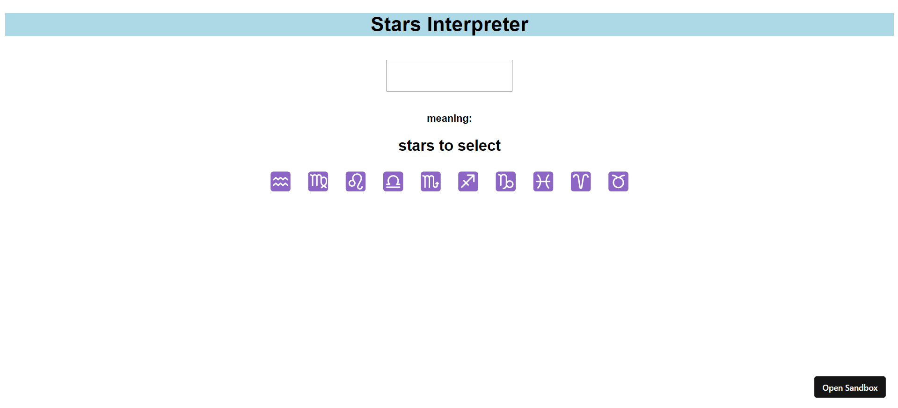
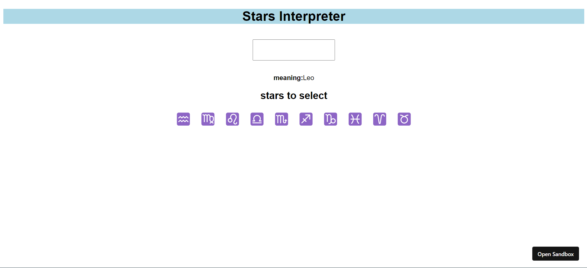
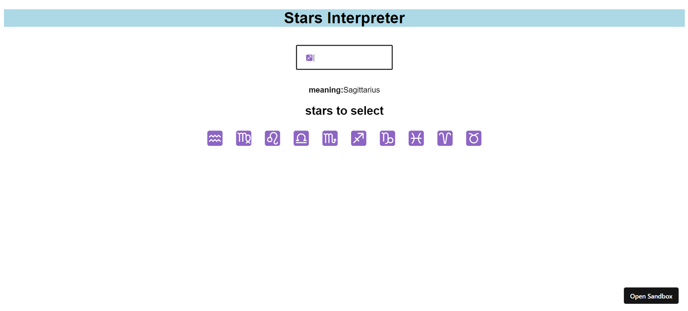
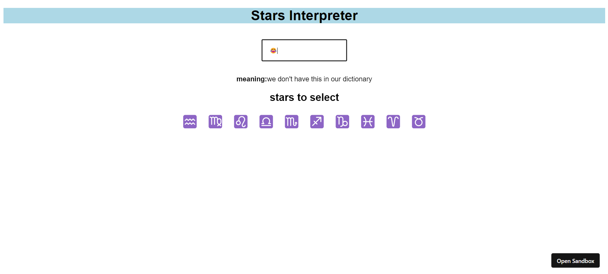

# Stars Interpreter Webapp
A React dictionary app which tells us the meaning of Star Emojis

Some of the webapp insights are as follows:

1. Landing page

2. Case1: Select from the list of stars provided

3. Case2: Directly search from search box

4. Case3: If the emoji is not present in our dictionary

> If you are confused regarding star emotes [click here](https://nobub.csb.app/) 

> Technologies/Libraries used :-
* ReactJS
* CSS
* HTML

> Platform used to develop project :-
* [Codesandbox](https://codesandbox.io/)
> Platform used to host and deploy the project :-
* [Github.com](https://github.com/ionbain)
* [Netlify.com](https://app.netlify.com/teams/bhaskartx/)
